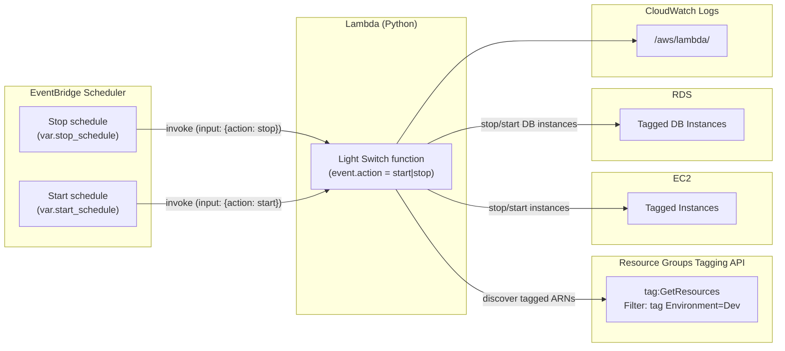

# Light Switch

Automate **stop** and **start** of **EC2 instances** and **RDS DB instances** that share a tag (default `Environment=Dev`), using **AWS Lambda (Python)** and **EventBridge Scheduler**.

**Tags:** `AWS` `Terraform` `Lambda` `EventBridge Scheduler` `EC2` `RDS` `Python`

## What you do manually

1. **Tag resources** you want in the schedule with the same key/value the Lambda uses (defaults: `Environment` / `Dev`).
2. Run Terraform in this folder to deploy the Lambda, IAM roles, and two schedules.

## Schedules (defaults)

| Action | Cron (Scheduler expression) | Meaning (in `schedule_timezone`) |
|--------|-----------------------------|------------------------------------|
| Stop   | `cron(0 18 ? * FRI *)`      | 18:00 every Friday                 |
| Start  | `cron(0 8 ? * MON *)`       | 08:00 every Monday                 |

Override `schedule_timezone` (IANA name, e.g. `America/New_York`) so “6 PM Friday” matches your local expectation. Defaults to `Etc/UTC`.

## How it works

- The Lambda reads **`action`** from the schedule input (`start` or `stop`).
- It uses the **Resource Groups Tagging API** (`tag:GetResources`) to find `ec2:instance` and `rds:db` ARNs with your tag, then calls EC2 start/stop and RDS start/stop APIs.
- **EventBridge Scheduler** invokes the Lambda using a dedicated IAM role; resource policies on the function allow only those two schedules.

## Architecture



## IAM (important)

The Lambda role includes:

- `tag:GetResources` to discover tagged ARNs.
- `ec2:StartInstances` / `ec2:StopInstances` with a condition on `ec2:ResourceTag/<tag_key>`.
- `rds:StartDBInstance` / `rds:StopDBInstance` with a condition on `rds:ResourceTag/<tag_key>`.

If permissions or tags are wrong, **CloudWatch Logs** for `/aws/lambda/<function-name>` will show errors—avoid “silent” failures by checking logs after the first run.

## RDS notes

- This targets **RDS DB instances** (`rds:db`), not Aurora **clusters** (`rds:cluster`). Extend the code/IAM if you need cluster stop/start.
- Stopped RDS instances still incur **storage** cost; you save mainly on **instance** hours.
- AWS places limits on how long a single-AZ instance can stay stopped; plan accordingly for dev databases.

## Deploy

```bash
cd light-switch
terraform init
terraform plan
terraform apply
```

Optional: set `aws_region`, `tag_key`, `tag_value`, `schedule_timezone`, `stop_schedule`, and `start_schedule` via `-var` or a `*.tfvars` file (gitignored by repo convention).

## Test invoke

```bash
aws lambda invoke --function-name "$(terraform output -raw lambda_function_name)" \
  --payload '{"action":"stop"}' --cli-binary-format raw-in-base64-out /tmp/out.json && cat /tmp/out.json
```

Use `"action":"start"` to start. Ensure your CLI credentials and region match Terraform.
